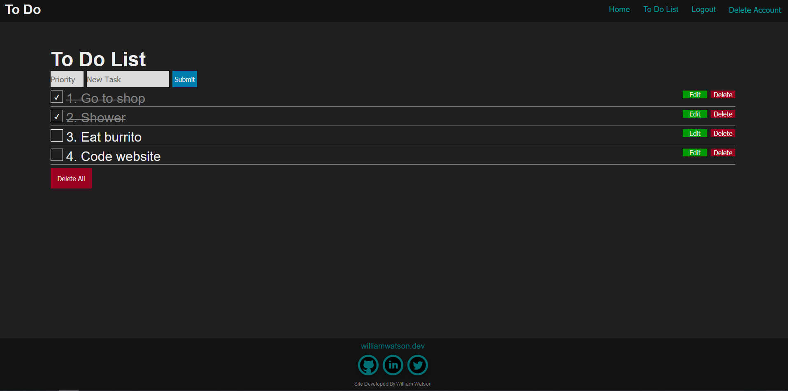

# To Do App

An Express To Do list Application which allows you to create an account which will have it's own to do list with full CRUD functionality, styled purely with css. Live project [_here_](https://to-do-app-willswats.herokuapp.com/).



## Table of Contents

- [To Do App](#to-do-app)
  - [Table of Contents](#table-of-contents)
  - [General Information](#general-information)
  - [Features](#features)
  - [Get started](#get-started)

## General Information

I built this project to refresh my mind on everything I learnt through completing the Web Developer Bootcamp 2021 Udemy course. The app's purpose is to be a list where you can write down your tasks for the day so that you do not forget them. As you complete your tasks you can tick them off so you know what you've completed. Your tasks will all be saved under the account you create.

## Features

- Add tasks with their own priority
- Check tasks that are complete
- Edit and delete tasks
- Create your own account to save your to do list
- Create a guest account to trial the app

## Get started

Clone this repo to your desktop and run ```npm install``` to install all dependencies.

After installing the dependencies, run MongoDB locally with `mongod`.

You can then run ```npm start``` to start the application. You will then be able to access it at localhost:3000
